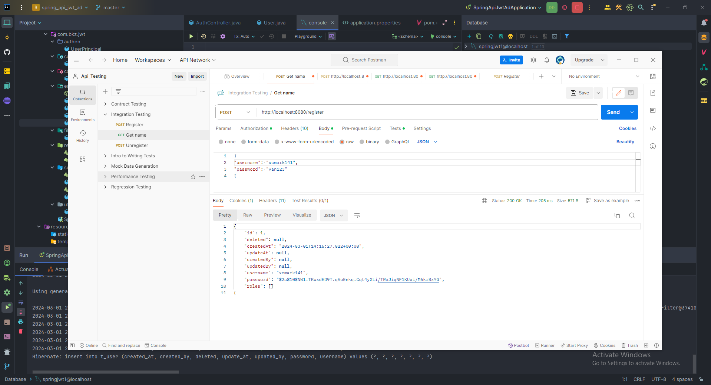
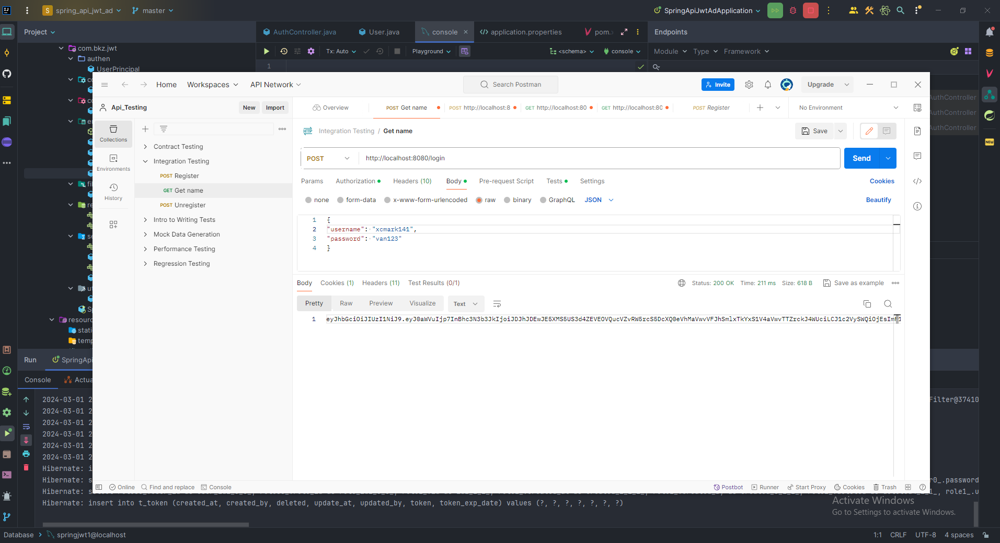
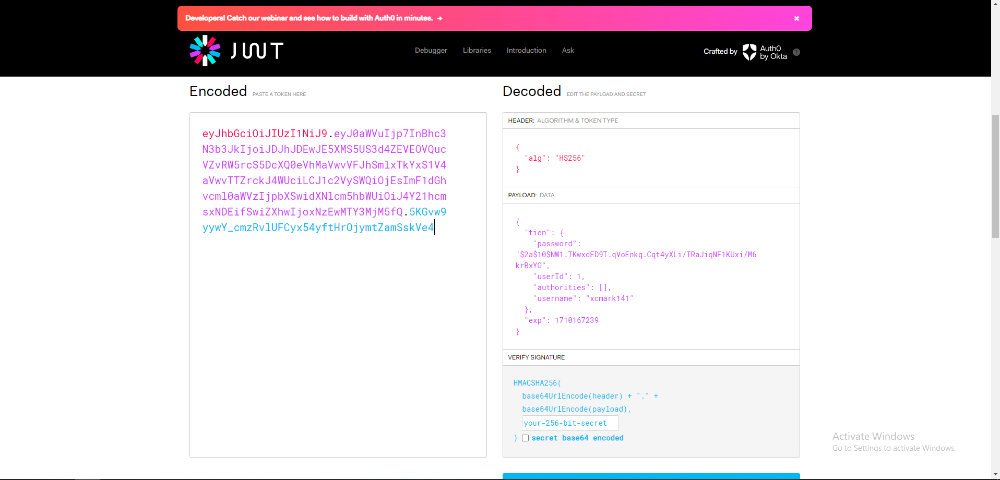

# Spring Boot JWT Authentication example with Spring Security & Spring Data JPA

## User Registration, User Login and Authorization process.
The diagram shows flow of how we implement User Registration, User Login and Authorization process.

1. [x] Register User:


## Spring Boot Server Architecture with Spring Security
You can have an overview of our Spring Boot Server with the diagram below:

2. [x] Login User:


3. [x] Check Token on web:

## Dependency
– If you want to use PostgreSQL:
```xml
<dependency>
  <groupId>org.postgresql</groupId>
  <artifactId>postgresql</artifactId>
  <scope>runtime</scope>
</dependency>
```
– or MySQL:
```xml
<dependency>
  <groupId>com.mysql</groupId>
  <artifactId>mysql-connector-j</artifactId>
  <scope>runtime</scope>
</dependency>
```
## Configure Spring Datasource, JPA, App properties
Open `src/main/resources/application.properties`
- For PostgreSQL:
```
spring.datasource.url= jdbc:postgresql://localhost:5432/testdb
spring.datasource.username= postgres
spring.datasource.password= 123456

spring.jpa.properties.hibernate.jdbc.lob.non_contextual_creation= true
spring.jpa.properties.hibernate.dialect= org.hibernate.dialect.PostgreSQLDialect

# Hibernate ddl auto (create, create-drop, validate, update)
spring.jpa.hibernate.ddl-auto= update

# App Properties
bezkoder.app.jwtSecret= bezKoderSecretKey
bezkoder.app.jwtExpirationMs= 86400000
```
- For MySQL
```
spring.datasource.url=jdbc:mysql://localhost:3306/testdb_spring?useSSL=false
spring.datasource.username=root
spring.datasource.password=123456

spring.jpa.properties.hibernate.dialect=org.hibernate.dialect.MySQLDialect
spring.jpa.hibernate.ddl-auto=update